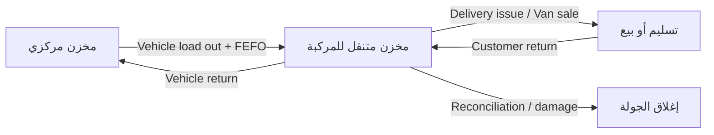

# معمارية مرحلة التوزيع والأسطول

## قاعدة البداية والنطاق

تبدأ المرحلة من نقطة الاستعادة **`3589d632`**؛ وكان مرجع الشفرة الفعلي قبل التعديل `3589d63`. تبقى نواة التجارة والمخزون كما هي، ويضاف عليها نطاق التوزيع والأسطول فقط. لا تشمل المرحلة تطبيق السائق أو GPS ميدانياً أو التصنيع أو دفتر الأستاذ العام.

## مبادئ العزل والحركة

كل سجل جديد يحمل `organizationId` ويُستعلم عنه بهذا الحقل دائماً. تُقيّد السجلات أيضاً بالفرع والمنطقة والمركبة عند توفرها، ويُتحقق من جميع المعرفات المرتبطة ضمن المعاملة ذاتها. المركبة لا تحتفظ برصيد يدوي؛ بل ترتبط بمخزن متنقل موجود في `warehouses` ذي `isMobile = yes`، وتُنشأ كل زيادة أو نقص من خلال `stock_movements` ودفعات `product_batches` وأرصدة `inventory_balances`.

| المجال | الجداول الأساسية | الضابط التشغيلي |
|---|---|---|
| الأسطول | `fleet_vehicles`، `fleet_vehicle_documents`، `fleet_fuel_logs`، `fleet_maintenance_records` | مركبة معزولة ومخزن متنقل منفصل ووثائق ذات تواريخ انتهاء |
| التوزيع | `distribution_territories`، `distribution_routes`، `distribution_route_stops` | الفرع والمنطقة والمركبة والموظف ضمن المؤسسة نفسها |
| التحميل | `vehicle_load_orders`، `vehicle_load_items` | FEFO من مخزن مركزي إلى مخزن المركبة وحساب وزن وحجم قبل الإرسال |
| التسليم والمال | `distribution_deliveries`، `distribution_delivery_items`، `distribution_collections`، `distribution_returns` | مفاتيح idempotency تمنع النشر المزدوج، ولقطات العملة محفوظة |
| الإغلاق | `distribution_route_expenses`، `distribution_route_closings` | انتقال Submitted → Reviewed → Approved → Closed وإعادة فتح مبررة ومدققة |
| الاستعداد الميداني | `fleet_gps_records`، `distribution_geofence_events`، `distribution_idempotency_keys` | نماذج فارغة قابلة للاستهلاك لاحقاً من تطبيق سائق، بلا GPS اصطناعي |

## مسار المخزون للمركبة

يُسمح بتحميل الدفعات النشطة فقط وغير المنتهية، وتُحسب السعة من بيانات المنتج: الوزن الإجمالي والحجم ووحدات الكرتون. تعالج سياسة الحمولة ثلاث حالات: تحذير، منع صارم، أو تجاوز إداري مدقق بالسبب والمستخدم والوقت.

## ملاحظة الربط التجاري

تحتوي النواة الحالية على فواتير مبيعات وليست جدول `Sales Orders` مستقلاً. لذلك يربط نموذج المرحلة محطات الجولة والتسليمات اختيارياً بـ`sales_invoices` الموجود، مع حقل مرجعي قابل لربط Sales Orders لاحقاً من دون نسخ مستندات التجارة أو إعادة تصميمها.
